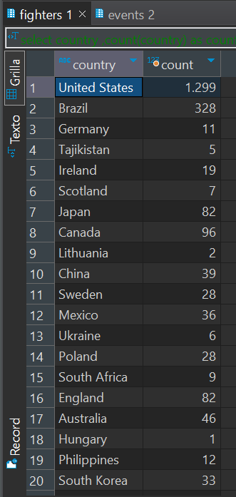
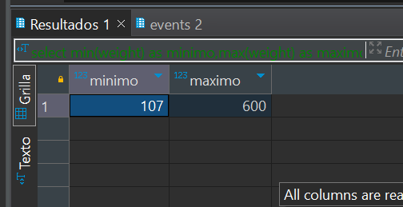

# Tarea 6 
## Conusltas que hice 

```sql
select 
	country,
	count(country) as count 
from fighters 
group by country;
```

```sql

select  
	min(weight) as minimo,
	max(weight) as maximo 
from fighters;

```

```sql

select  
	winner_name,
	count(winner_name) as count 
from fights
where winner_name != '' 
group by winner_name  
order by count(winner_name) desc 
limit 1 ;
```


## Hallazgos 
Encontre en la consulta 4 que para MySQL se nesecita usar limit 1 y no Top 1

